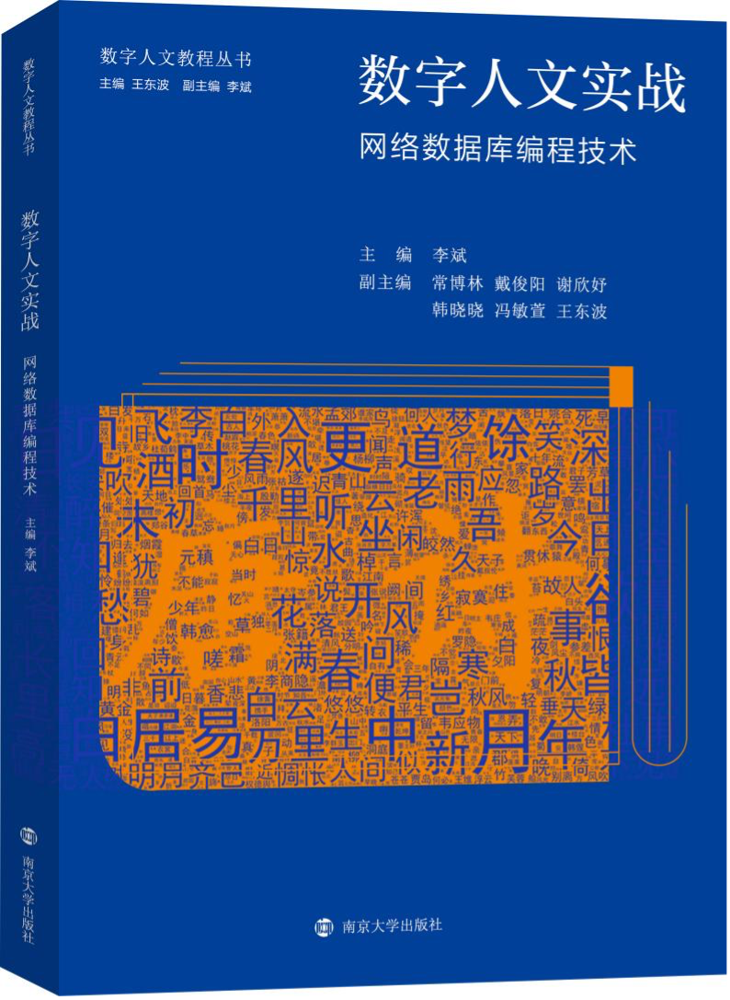

# 《数字人文实战:网络数据库编程技术》简介
# Digital Humanities in Practice: Web Database Programming Techniques

## 教材内容

《数字人文实战：网络数据库编程技术》一书，2024年由南京大学出版社出版。全书共分 5 大板块，11个章节。

-   第一部分从最易入门的 Access 数据库开始入门；
-   第二部分过渡到稍有挑战性的 MySQL 数据库操作，逐步帮助读者打下坚实的数据库基础；
-   第三部分介绍如何用 SQL 语言进行数据查询，分析和处理文学作品中的信息，如统计《全唐诗》中五言诗的数量；
-   第四部分讲述HTML 到 PHP动态网页开发，帮助读者逐步学习如何将数据库与网站结合，创建交互式的网络查询平台；
-   第五部分讨论如何利用 javascript 等编程语言和百度地图等工具，将古籍经典中的数据以可视化的方式呈现，使得数据和信息更加直观易懂。

## 目录
本书从数据库基础入门，逐步深入到网页设计、动态编程、数据处理，最终引导读者构建一个完整的古籍检索与可视化系统，形成了一个循序渐进、由浅入深的学习路径。
-  第1章 概论
-  第2章 Access数据库操作
-  第3章 基于Access数据库的语料检索
-  第4章 MySQL数据库的操作
-  第5章 SQL查询
-  第6章 静态网页制作
-  第7章 动态网页制作与PHP程序设计
-  第8章 字符编码与字符串处理
-  第9章 文件处理与网络爬虫
-  第10章 古籍检索系统构建
-  第11章 数据可视化
-  参考文献与扩展阅读

在数字浪潮的推动下，数字人文这一让人文与计算相结合的新兴交叉学科逐渐在古籍数字化、智能化研究中彰显重要地位，而熟识古典文献的文理交叉人才培养又极其困难。作为一本诞生于人工智能时代面向文科生的教材，此书的五大主要特点如下:

### 一、打破长久以来“ 文科生与技术绝缘 ”的偏见，在文学中掌握编程技术。

此书以独特的视角与幽默的语言，打破学习数据库等于单调记忆 SQL 编程语法的“刻板印象”，通过破解《全唐诗》中的字频与诗歌韵律，或是追踪人物的历史轨迹等教学目标的引导，让编程技能的学习不拘泥于掌握新技术,而更注重激发文科读者对古籍的新理解和深层次的洞察。

### 二、独创性融合古典文学与现代技术。

此书不是单纯地教授编程技巧，而是引导读者学会用技术的眼光重新审视经典。当读者用 SQL 语句分析李白的诗作，或用 JavaScript 可视化杜甫的人生轨迹时就将会发现其中蕴含的数字魅力，原来数字技术可以如此优雅又条分缕析地展现文学之美。这种跨界思维将促进多学科融合，为数字化时代创造更多的可能。

### 三、“边学边做”的实践教学模式，寓教于乐。

此书采用“边学边做”的实践教学模式，每一章都配备了丰富的实战项目和理论讲解。从基础的数据库操作，到复杂的网络爬虫技术，再到高级的数据可视化应用，读者在学习理论知识的同时，可以亲手实践，打造属于自己的数字人文项目。

### 四、着眼于当下热门技术在人文领域的应用。

此书深入探讨了如何使用数据库和网页技术构建古籍检索系统，以及如何通过地理信息系统还原古代文学作品中的地理场景。这些前沿技术的应用，不仅为学术研究提供了更为便捷和高效的工具，也大大提升了学习者的竞争力。
器字人文餐科及技数字人文实战网络数据库编程技术

### 五、秉持丰富开放性和延展性原则，倡导发散性思维。

此书在每章末尾都设置了“思考与实践”环节，鼓励读者将所学知识应用到自己感兴趣的领域中。无论读者是对古典诗词情有独钟，还是对现代文学痴迷不已，都能在本书中找到适合自已的项目方向。这种灵活多样的学习方式，让学习不再局限于课本和课堂，而是一次充满乐趣和挑战的自我探索之旅。

《数字人文实战》一书,着眼于“学以致用”而非纸上谈兵每一个概念，每一行代码，都与实际应用紧密相连。在这个数据驱动的时代，掌握这些技能不仅能够激发读者对古典文学的研究新视角，更能够培养读者在技术领域的实践能力和创新思维。

## 教材应用

### 数字人文系列讲坛·数据库编程应用

2024年1月13日至22日，南京师范大学文学院语言大数据与计算人文研究中心举办首届了“数字人文系列讲坛·数据库编程应用”。该寒假学院申报课程为主体，进行了32课时的数字人文与数据库编程教学，特邀3位知名学者讲座《荀子大模型的构建与应用》《中国民族语言知识库构建及应用》《基于语料库的搭配研究与英文论文写作》，扩大学员的视野。来自日本早稻田大学、韩国檀国大学、澳门大学、北京大学、浙江大学、复旦大学等海内外43所高校的近百位师生参加学习，制作完成了约60个人文数据库。

课程结束后，学员们纷纷表示收获很大，最好能持续开展并配套教材。而教材此时已完成了大半，正值2024年4月至8月赴澳门大学担任客座研究员，可以更好地完稿。在澳门大学与袁毓林教授团队的合作研究中，发现这门课程在澳门大学人文学院就有着非常大的需求，加之另外两位计算语言学也在访学，由此开始策划暑期学院，得到了人文学院院长长江学者徐杰教授，中国语言文学系主任长江学者袁毓林教授的大力支持，以及澳大图书馆梁德海副馆长提供的珍贵馆藏数据作为课程材料。

### 澳大-南师语料库与数字人文暑期学院

2024年8月10日至18日，南京师范大学文学院语言大数据与计算人文研究中心与澳门大学人文学院与联合举办了“澳大-南师语料库与数字人文暑期学院”，通过线上线下结合的32课时讲授语料库和数字人文的知识和技术，特别邀请了7位知名学者讲座来拓展学生的视野。暑期学院吸引了来自全球20个国家及地区的371所高等院校的956名师生参与报名，最终录取在线及线下总计110名学员参加8天的学习，制作完成90多个数据库系统。

### 读者反馈与勘误表
部分留言：
  本文科生一直很苦恼怎么将自己所学的知识更有效地应用于实践中。希望这本书能帮助拓展我的研究视野。
  网络数据库编程技术对文学方面的研究很有帮助，比如说传统的文献汇总等工作，非常希望可以看这本书，给自己的研究增加一些新的视角和资料数据库。

勘误表请见Corrections.md文件。

