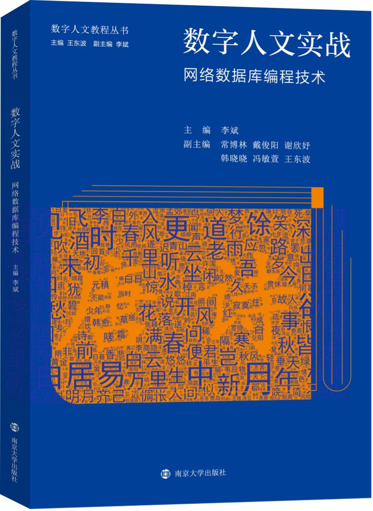
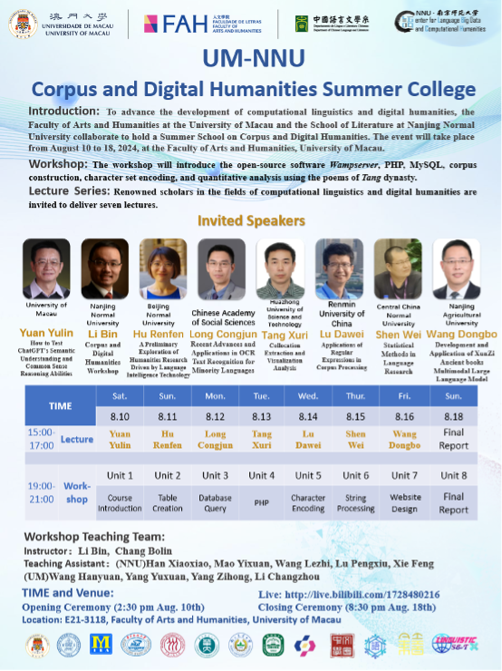

# Digital Humanities in Practice:

# Web Database Programming Techniques

---

## Textbook Content

***Digital Humanities in Practice: Network Database Programming Technology,* published by Nanjing University Press in 2024 which is divided into 5 sections and 11 chapters.**

- **Part 1** Start teaching from the easiest Access database
  
  - Dedicated to helping readers lay a solid database foundation
- **Part 2** Preliminarily understand the operation of MySQL database
  
  - Learn how to systematically store information in literary works
- **Part 3** Set out to figure out how to use SQL to query data, analyze and process information in literary works
  
  - Analyze the word frequency of *Complete Tang Poems* through data mining
    
  - Count the images from *the Book of Poetry*
    
- **Part 4** Talk about how to use HTML and PHP for dynamic web development
  
  - Learn to combine databases with websites
    
  - Create an interactive web query platform
    
- **Part 5** Discuss how to use programming languages such as JavaScript and tools such as Baidu map to construct a visual query website
  
  - Build a complete system which can retrieve, analyze and display ancient books
    
  - Enhance reader's practical operation ability
    

---

## Catalogue

This book starts from the database foundation, gradually in-depth to web design, dynamic programming, data processing, and finally guides readers to build a complete ancient book retrieval and visualization system, forming a step-by-step, from shallow to deep learning path.

> **Chapter 1** Introduction
> 
> **Chapter 2** Database Manipulation of Access
> 
> **Chapter 3** Corpus Retrieval Based on Access Database
> 
> **Chapter 4** Database Operations about MySQL
> 
> **Chapter 5** SQL Queries
> 
> **Chapter 6** Static Web Page Development
> 
> **Chapter 7** Dynamic Web Page Development and PHP Programming
> 
> **Chapter 8** Character Encoding and String Processing
> 
> **Chapter 9** File Handling and Web Crawling
> 
> **Chapter 10** Construction of Ancient Text Retrieval Systems
> 
> **Chapter 11** Data Visualization
> 
> **References and Further Reading**

---

### Five Key Features

Driven by the digital wave, digital humanities,an emerging interdisciplinary field that combines humanities with computing, is increasingly demonstrating its importance in the digitization and intelligent research of ancient texts. However, cultivating interdisciplinary talents proficient in both classical literature and technology is extremely challenging.

As a textbook born in the era of artificial intelligence and aimed at liberal arts students, this book has the following five main features:

#### 1. Breaking the long-standing bias that "liberal arts students are insulated from technology", enabling the mastery of programming skills within the context of literature.

This book, with its unique perspective and humorous language, shatters the "stereotype" that learning databases equates to monotonously memorizing SQL syntax. By guiding readers through objectives such as deciphering character frequencies and poetic rhythms in the *Complete Tang Poems* or tracking historical trajectories of figures, the learning of programming skills is not confined to mastering new technologies. Instead, it emphasizes inspiring humanities readers to gain new insights and deeper understanding of ancient texts.

#### 2. Innovatively integrating classical literature with modern technology.

This book does not merely teach programming techniques but guides readers to re-examine classics through a technological lens. When readers use SQL statements to analyze Li Bai's poetry or visualize Du Fu's life trajectory with JavaScript, they will discover the digital charm embedded within. It turns out that digital technology can so elegantly and systematically reveal the beauty of literature. This cross-disciplinary thinking will promote multi-disciplinary integration and create more possibilities for the digital era.

#### 3. A "learning by doing" practical teaching model that makes education enjoyable.

This book adopts a "learning by doing" practical teaching model, with each chapter equipped with rich hands-on projects and theoretical explanations. From basic database operations to complex web crawling techniques and advanced data visualization applications, readers can practice what they learn while building their own digital humanities projects.

#### 4. Focusing on the application of cutting-edge technologies in the humanities.

This book delves into how to use databases and web technologies to construct ancient text retrieval systems and how to restore geographical scenes in classical literary works through geographic information systems. These applications of cutting-edge technologies not only provide more convenient and efficient tools for academic research but also significantly enhance learners' competitiveness.

#### 5. Upholding principles of richness, openness, and extensibility, advocating for divergent thinking.

This book includes a "Thinking and Practice" section at the end of each chapter, encouraging readers to apply what they have learned to their areas of interest. Whether readers are passionate about classical poetry or fascinated by modern literature, they can find suitable project directions in this book. This flexible and diverse learning approach ensures that education is not confined to textbooks and classrooms but becomes a fun and challenging journey of self-exploration.

*Digital Humanities in Practice* focuses on "learning for application" rather than mere theoretical discussion. Every concept and every line of code is closely connected to practical applications. In this data-driven era, mastering these skills not only inspires readers to explore classical literature from new perspectives but also cultivates their practical abilities and innovative thinking in the technological field.

---

## Textbook Applications

### Digital Humanities Lecture Series: Database Programming Applications

From January 13 to 22, 2024, the Language Big Data and Computational Humanities Research Center at Nanjing Normal University's School of Liberal Arts hosted the first "Digital Humanities Lecture Series: Database Programming Applications." This winter school, based on the course application, offered 32 class hours of digital humanities and database programming instruction. It featured lectures by three renowned scholars on *The Construction and Application of the Xunzi Large Model*, *The Construction and Application of the Chinese Ethnic Language Knowledge Base*, and *Corpus-Based Collocation Research and English Academic Writing*, broadening participants' horizons. Nearly 100 faculty and students from 43 domestic and international institutions, including Waseda University, Dankook University, the University of Macau, Peking University, Zhejiang University, and Fudan University, participated in the program and completed approximately 60 humanities databases.

After the course, participants expressed significant gains and hoped for its continuation with accompanying textbooks. By this time, the textbook was mostly complete, and during a visiting research fellowship at the University of Macau from April to August 2024, it could be finalized. Collaborating with Professor Yuan Yulin's team at the University of Macau, it became evident that this course had substantial demand within the university's Faculty of Arts and Humanities. With two other computational linguists also visiting, plans for a summer school began, receiving strong support from Dean Xu Jie, a Changjiang Scholar, and Professor Yuan Yulin, head of the Department of Chinese Language and Literature. Additionally, Deputy Library Director Liang Dehai provided valuable archival data as course materials.

### University of Macau-Nanjing Normal University Summer Institute on Corpus and Digital Humanities

From August 10 to 18, 2024, **the Language Big Data and Computational Humanities Research Center** at Nanjing Normal University's School of Liberal Arts and the Faculty of Arts and Humanities at the University of Macau jointly hosted the **"University of Macau-Nanjing Normal University Summer Institute on Corpus and Digital Humanities."**

Through a combination of online and offline sessions totaling 32 class hours, the institute taught knowledge and techniques in corpus linguistics and digital humanities. Seven renowned scholars were specially invited to deliver lectures, broadening students' academic horizons. The summer institute attracted 956 faculty and students from 371 institutions across 20 countries and regions worldwide. Ultimately, 110 participants (both online and offline) were admitted to the 8-day program, successfully completing over 90 database systems.

---

### <mark> Student Achievements</mark>

- **Yu Zihan** developed a **Global Top Ten Fountain Pens Retrieval System**.
  
  - She mentioned that this was her first time learning to code, which significantly enhanced her understanding of programming.
- **Guo Siwen** created a **Database of Synonym Expressions in Thesis Abstracts and News Reports**.
  
  - Professor **Li Bin** suggested expanding the dataset, while Professor **Feng Minxuan** proposed identifying differences between terms and refining the article organization at the lexical level.
- **Lu Yong** constructed a **Knowledge Base of Traditional Rice Varieties in Ancient China**.
  
  - He aimed to integrate rice varieties from local chronicles and conduct further analysis based on the database. During data collection, he encountered challenges with annotation and visualization.
    
  - Professor **Qiu Weiyun** suggested envisioning user research capabilities during platform design, creating user personas, and understanding user needs in advance.
    
- **Cui Linxin** built a **Retrieval System for Inscribed Poems on Paintings**.
  
  - Professor **Qiu Weiyun** recommended incorporating seal information and using knowledge graphs for better presentation.
- **Zhan Hongwei** developed an **English Morpheme Retrieval System**.
  
  - It could greatly benefit English learners.
- **Wu Zhongzheng** created a **Chinese-English Database of Northern Frontier History and Culture**, enabling specific sentence translations to improve efficiency.
  
  - Professor **Qiu Weiyun** noted that this database could not only enhance translation efficiency but also serve as a foundation for researching Northern Frontier history and culture.
    
  - Professor **Liu Liu** suggested focusing on named entity recognition.
    
- **Yang Yulin** constructed a **Retrieval System for the *Complete Yue Poems***, showcasing strong regional characteristics.
  
- **Zhou Jie** developed a **Song Ci Poetry Retrieval System**.
  
  - She hopes to further mine data and the system could enable retrieval through imagery in the future.
- **Gao Qing** built a **Tang Dynasty Jiangxi Poetry Retrieval System**.
  
  - Professor **Qiu Weiyun** suggested adding retrieval capabilities for synesthesia and imagery.
- **Ding Anqi** created a **Retrieval System for Grammatical Structures in *Shishuo Xinyu***, allowing searches based on different fields.
  
- **Zhao Xue** developed a **Database of Modern Linguistics Classic Literature**.
  
- **Hu Guanghua** constructed a **Retrieval System for the *Book of Poetry***.
  
  - He primarily aimed at studying geographical names within the text.
- **Gao Ce** built a **Retrieval System for Yuan and Ming Dynasty Zaju Play Manuscripts**.
  
  - She noted that the data is currently incomplete and hopes to further expand it in the future.
- **Xi Jingxuan** developed a **Retrieval System for Disyllabic Words in the Wei, Jin, and Northern and Southern Dynasties.**
  
  - It covered fields including entries, literature, parts of speech, and definitions.
- **Chen Shu** created a **Chinese Neologism Retrieval System**.
  
  - It can search for all related terms and their definitions based on keywords.
- **Dong Yize** constructed a **Research Paper Retrieval System for the Digital Humanities Research Center**.
  
  - It allowed searches for PDFs of papers published by the center's faculty.
- **Xiong Huanhuan** built a **Retrieval System for Ming Dynasty Sichuan Academies**, enabling searches for historical academy overviews in specific Sichuan locations.
  
- **Zhou Qihong** developed a **Corpus of Chinese Academic Paper Abstracts**.
  
  - This allowed searches for paper titles, authors, content, and publication years.
- **Huang Haimo** created a **Common Diseases Retrieval System**.
  
  - It supported retrieving diseases, medications, and treatment plans, with strongly practical value.
- **Tang Huitao** built a **Retrieval System for Behavioral Characteristics of Synonyms in Cross-Register Contexts**.
  
- **Cheng Xu** developed a **Retrieval System for the *Heyue Yingling Ji***.
  
- **Ji Jiaojiao** constructed a **Zhu Xi Retrieval System**.
  
  - This system supported retrieving geographical information, social networks, and worked to analyze the evolution of Zhu Xi's Neo-Confucian thought.
- **Yang Ruijia** created **a Vocabulary Retrieval System for the *Nancun Chuogeng Lu***.
  
- **Tu Miao** built a **Retrieval System for Zhang Juzheng's Correspondence**.
  
- **Wu Xiuju** developed a **Miao Riddle Retrieval System**, with content in both Chinese and Miao languages.
  
- **Ding Xiaoyu** constructed a **Boatman's Chant Retrieval System**.
  
- **Yao Shuqi** created a **Retrieval System for the *Tao Te Ching*** .
  
  - It expressed hopes to build a multimodal database for Qinqiang opera in the future.
- **Guan Shupeng** built a **Chinese Local Chronicles Retrieval System**.
  
- **Wang Boxuan** developed a **Guangyun Retrieval System**.
  
  - It supported retrieving rhyme characters, initial characters, rhyme groups, tones, and final characters.
- **Li Jinke** constructed a **Dictionary Comparison Database**.
  
  - It supported searches for differences between the *Modern Chinese Dictionary* and the *Standard Modern Chinese Dictionary*.
- **Chen Xue** created an **Idiom Retrieval System**.
  
  - The system included idioms, pinyin, emotional connotations, parts of speech, and definitions.
- **Feng Jiajin** built a **Cantonese Common Character Retrieval System**.
  
  - From this system,we could find standard Cantonese characters, Mandarin pronunciation, Cantonese pinyin, meanings, and examples.
- **Yan Lingling** developed a **Chinese Painting Retrieval System**.
  
- **Dai Zheyuan** constructed a **Popular Song Retrieval System**.
  
- **Gong Taoxi** created a **Retrieval System for the *Analects***.
  
- **Huang Qihong** built a **Related Language Text Database**.
  
- **He Xiaolin** developed a **WeChat Public Account Corpus Retrieval System**.
  

---

### Reader Feedback and Errata

#### Selected Comments

> "As a liberal arts student, I have always struggled with how to apply my knowledge more effectively in practice. I hope this book will help expand my research horizons."
> 
> "Network database programming technology is highly beneficial for literary research, such as traditional literature compilation work. I am very much looking forward to reading this book to add new perspectives and database resources to my research."

---

##### Others

To view the errata, please refer to the [`Corrections.md`]() file.
---
For a brief introduction in Chinese, please see [README.md](https://github.com/GoThereGit/textbooks/blob/main/README.md "README.md")
